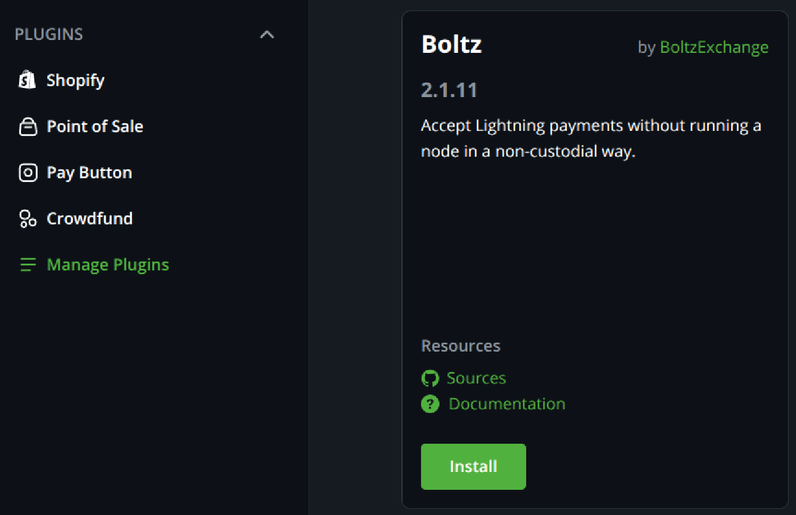
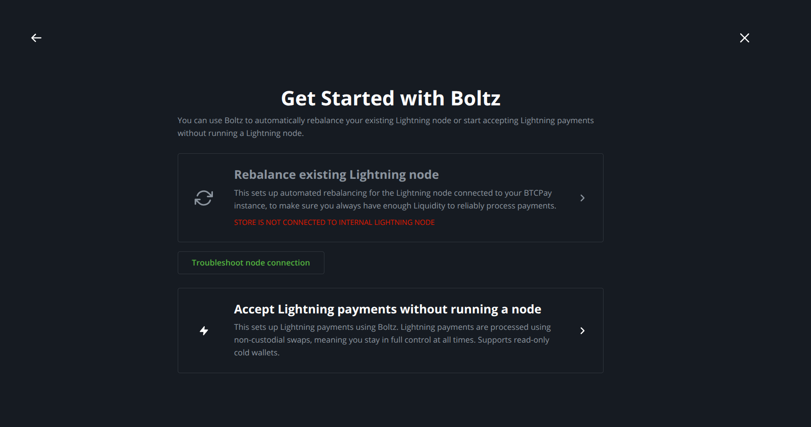
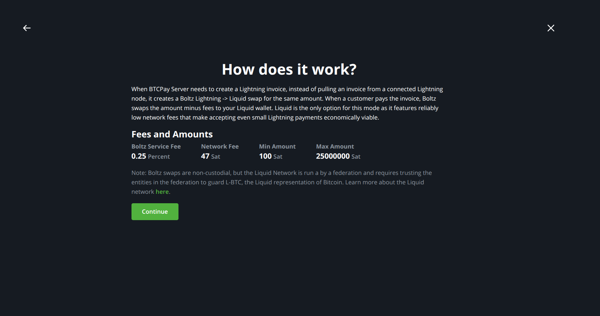
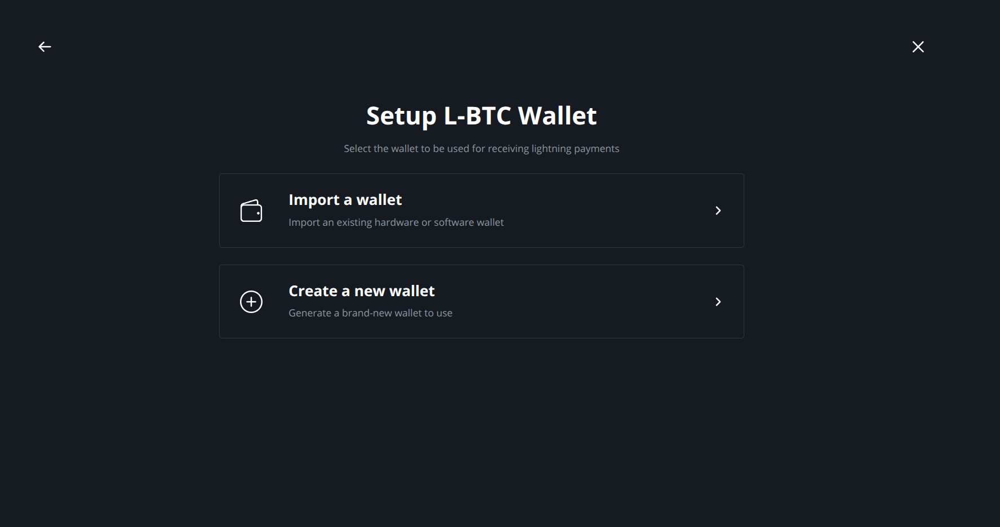
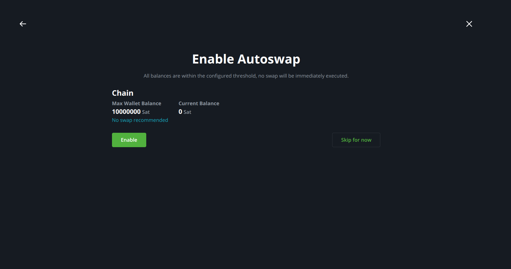
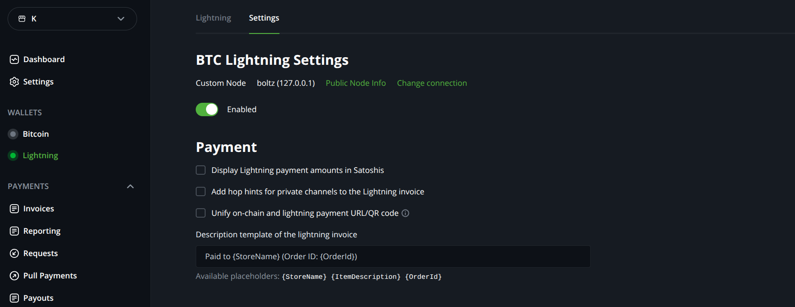

# 👋 Introduction

The Boltz BTCPay Plugin allows any merchant to accept Lightning payments in a
non-custodial way without running a Lightning node or fully manage liquidity
of an existing Lightning node.

## How do I install the plugin?

**Merchants using a self-hosted server:** Navigate to the "Manage Plugins" section and install the "Boltz" plugin by [BoltzExchange](https://github.com/BoltzExchange).

**Merchants using a shared server:** Contact your server administrator to request the plugin installation.

<figure><figcaption>

Boltz Plugin is one of the few options for merchants on a shared instance to accept Lightning payments without creating and linking custodial third party accounts.
</figcaption></figure>

**Choose Operational Mode:** Once the plugin is installed, locate the new "Boltz Plugin" menu item to start the setup. The first step is to choose the operational mode. One can choose between letting the plugin manage liquidity of a connected Lightning node or accept Lightning payments without running a node. We choose the latter.

<figure><figcaption></figcaption></figure>

**Review Fee Structure and Swaps:** Next, the plugin gives us a fee breakdown and explains how it uses Lightning -> [Liquid](https://liquid.net/) swaps to achieve the nodeless experience.

<figure><figcaption></figcaption></figure>

**Wallet Setup:** Create a new wallet or import your existing Liquid wallet, which can be read-only for enhanced security as destination for swaps. If unsure, create a new wallet and follow the instructions.

<figure><figcaption></figcaption></figure>

**Configure Chain Swaps:** Optionally, the setup allows to configure "Chain Swaps", meaning to swap Liquid Bitcoin to regular mainchain Bitcoin based on a max wallet balance you are comfortable holding in Liquid Bitcoin. You can skip this step, if you prefer to exchange Liquid for mainchain Bitcoin manually. Otherwise, set a budget and confirm.

<figure><figcaption></figcaption></figure>

Done! "Lightning" shows active and running!  🎉

<figure><figcaption></figcaption></figure>

It's a good idea to do a small test purchase to verify things are working. If you are running into issues, feel free to reach out in our [Boltz BTCPay Plugin Telegram community](https://t.me/+YdK0sV1OaVJmZjM1).

::: info
BTCPay Server v2 is the only supported major version, BTCPay Server v1 support was discontinued
:::

## How does the plugin work under the hood?

From an architectural perspective, [Boltz BTCPay Plugin](https://github.com/BoltzExchange/boltz-btcpay-plugin) is mainly a UI for [Boltz Client](https://docs.boltz.exchange/v/boltz-client), our long-running swap daemon. The plugin downloads latest release binaries of Boltz Client by default, checks the PGP signature and, if all checks out, starts the daemon.
