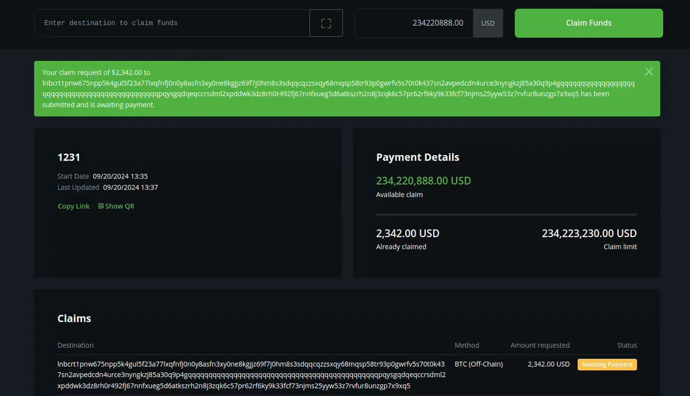

# 🚧 Limitations

One **major limitation** that we are aware of today, is the lack of support for 0-amount invoices for pull payments or refunds as 0-amount invoices can’t be handled non-custodially by Boltz. Nothing we can change about this, but the real UX issue with the Boltz BTCPay Plugin is that we can’t display an error to show this to the user.

The current UX for end-users is as follows: when they try to claim a payout using a 0-amount invoice, the payout shows as “Awaiting Payment”:

<figure><figcaption></figcaption></figure>

Only after manually refreshing the page does it become visible that the payout was canceled:

<figure><figcaption></figcaption></figure>

The user has no way of knowing that the payment was canceled due to the use of a 0-amount invoice. Therefore, we recommend to be on the lookout for pending pull payments and advise users to use wallets like Phoenix or Aqua, which allow setting amounts for Lightning invoices.

To properly display an error message, BTCPay needs reworking of quite some things internally and this will take some time, here the non-exhaustive list of issues we are working on to make it happen:

* [https://github.com/btcpayserver/btcpayserver/pull/6219](https://github.com/btcpayserver/btcpayserver/pull/6219)
* [https://github.com/btcpayserver/btcpayserver/issues/6131](https://github.com/btcpayserver/btcpayserver/issues/6131)
* [https://github.com/btcpayserver/BTCPayServer.Lightning/pull/163](https://github.com/btcpayserver/BTCPayServer.Lightning/pull/163)
* [https://github.com/btcpayserver/btcpayserver/discussions/6221](https://github.com/btcpayserver/btcpayserver/discussions/6221)
* [https://github.com/btcpayserver/btcpayserver/discussions/6220](https://github.com/btcpayserver/btcpayserver/discussions/6220)

Also, as a security measure, BTCPay Server admins have to manually enable Boltz Plugin for their users after installation.

<figure><figcaption>
If you are operating a BTCPay instance and want to enable Boltz BTCPay plugin for your users, you can do so via Admin → Advanced → “Allow Plugin for Tenants”
</figcaption></figure>

